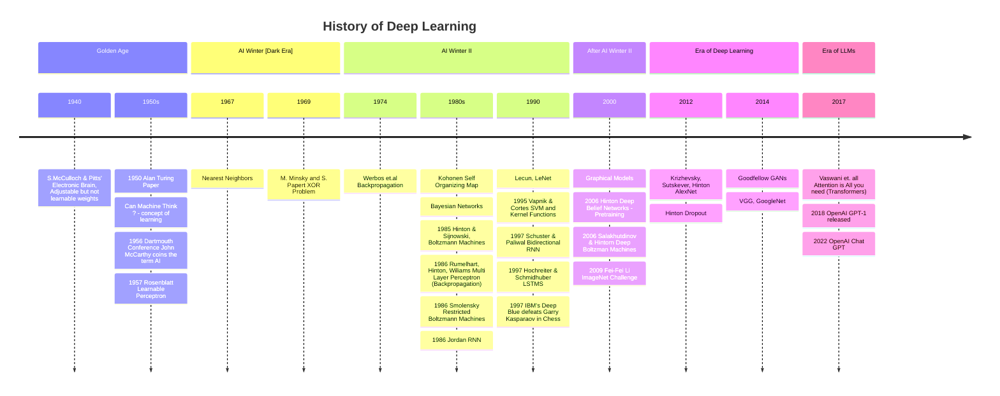

# The Pursuit of AI

The pursuit to AI dates back to ancient times in ancient civilization through myths, stories, and rumors of artificial beings (idea of robots) with intelligence or consciousness that can perform tasks on their own.

## Ancient Myths and Automata

**Greek Mythology** (~700 BC): Zeus, the king of Greek gods, commisioned Hephaestus, the Greek god of invention and blacksmithing to build [Talos](https://news.stanford.edu/2019/02/28/ancient-myths-reveal-early-fantasies-artificial-life/) a bronze giant build by to protect the island of Crete. Talos stood guard over the island, tirelessly patrolling the shores three times a day and hurled massive boulders towards invading enemy ships. Talos had a tube running from his head to feet that carried a mysterious life-giving elixir called 'ichor'. Later in another text sorceress Medea defeated Talos by removing a bolt of Talos ankle draining the ichor fluid. Hephaestus also build an artificial evil woman sent to Earth with task to punish humans for discovering fire. Hephaestus also created several young golden Maidens.

**Jewish folklore**, Golems created from inanimate matter such as clay or mud are brought to life to serve some purpose such as to defen against antisemitic attacks. Even in the Bible God create man from dust "the Lord God formed man of the dust of the ground, and breathed into his nostrils the breath of life; and man became a living soul."

**Hindu mythology** the Vishwakarma, the god of craftsmanship and the architect of gods, and the sorceress Maya had created automation along with many architectural wonders. Vishwakarma (meaning: world creator) is also regarded as the creator of the Brahma, Vishnu and Shiva. Furthemore, Indian Lokapannatti (collection of cycles and lores from 11 century AD), tells the story of how an army of automated soldiers (bhuta vahana yanta) were crafted to protect the relics of Buddha in a secret stupa.

**Automata**: In ancient China and Greece, inventors created automata, which were self-operating machines designed to mimic human actions. The first recorded of artificial automation was [steam-powered pigeon by Archytas of Tarentum (428 BC)](https://www.ancient-origins.net/history-famous-people/steam-powered-pigeon-002179), [Hero of Alexandria (10-70 CE) constructed an automata puppet theater, where the figurines and the stage sets moved by mechanical means. Among the first verifiable automation is a humanoid knight drawn by Leonardo da Vinci in around 1495](https://en.wikipedia.org/wiki/History_of_robots).

## Age of Enlightenment

**1600s**: The 1600s saw the rise of the Scientific Revolution, which emphasized the use of reason and experimentation to understand the natural world. This period saw the development of new mathematical and scientific theories, which laid the foundation for the development of modern AI.

**1700s**: The 1700s saw the development of the first mechanical computers, such as the Pascaline and the Jacquard loom. These machines were designed to perform repetitive tasks, and they laid the foundation for the development of modern computing.

The term "robot" was coined in a satire play published by the Czech Karel Čapek in 1921. R.U.R. (Rossum's Universal Robots), robots were manufactured biological beings that performed all unpleasant manual labors.

## The Birth of AI

The World Wars were not just a period of immense destruction and suffering but also acted as catalysts for rapid technological advancement and discoveries. The need for complex calculations (ballistic calculation) and crypt decoding led to the development of the first programmable computers such as ENIAC (Electronic Numerical Integrator and Computer) and Colossus. These programmable machines were used for a variety of purposes, including military and scientific research. Later, commercial computers such as UNIVAC I (Universal Automatic Computer) (1951) IBM 701 (1952), were developed, which were used for a variety of purposes, including business data processing and scientific calculations.

### The Dartmouth Conference (1956)

- **Coining the Term "AI"**: The term "artificial intelligence" was coined during the Dartmouth Conference, organized by John McCarthy, Marvin Minsky, Nathaniel Rochester, and Claude Shannon.

- **The Proposal**: The proposal stated that "every aspect of learning or any other feature of intelligence can in principle be so precisely described that a machine can be made to simulate it."

However in early 1950s, there were various names for the field of "thinking machines" such as automata theory, cybernetics and complex information processing and so on. [In 1955 John McCarthy, professor of Mathematics at Dartmouth college coined the name "Artificial Intelligence" for the new field and with Marving Misky, Nathaniel Rochester and Claude Shannon proposed a 2-month, 10-man study of artificial intelligence during summer of 1956](https://en.wikipedia.org/wiki/Dartmouth_workshop) to discuss and study on how to make machine use language, form abstractions and concepts to solve problems requiring some intelligence. Allen Newell and Herbert Simon has a reasoning program the Logic Theorist (LT) capable of thinking non-numerically and later was able to prove many theorems. The Darthmouth workshop did not lead to any new breakthroughs, but the discussion topics from this conference  initiated different domain such as the rise of symbolic theorem proving methods, early expert system and deductive systems versus inductive systems.

### The Early AI

**Checkers(1952)**: Developed by Arthur Samuel, this program was designed to play checkers and improved its performance through trial and error. It played at strong amateur level.

**Logic Theorist (1955)**: Created by Allen Newell and Herbert A. Simon, this program was designed to mimic human problem-solving skills and proved theorems in symbolic logic.

- **General Problem Solver (1957)**: Another creation by Newell and Simon, this program aimed to solve a wide range of search problems using a heuristic approach.

## The Rise of AI

**ELIZA (1966)**: Developed by Joseph Weizenbaum, ELIZA was an early natural language processing program that simulated a conversation with a psychotherapist.

**Shakey the Robot (1966-1972)**: Created by the Stanford Research Institute, Shakey was the first robot to use AI to navigate and perform tasks in a structured environment.

### The AI Winter

There was overwhelming optimisim in the 1960s, with many researchers believing that AI would soon be able to perform tasks that were previously considered impossible.

- > "Machines will be capable, within twenty years, of doing any work a man can do." — Herbert Simon

- > "Within 10 years the problems of artificial intelligence will be substantially solved." — Marvin Minsky

- > "I visualize a time when we will be to robots what dogs are to humans, and I'm rooting for the machines." — Claude Shannon

However, this optimism was not well-founded, and the field faced several challenges that slowed its progress. Machine translation was not able to match human performance, and the field faced a lack of funding and resources.

**The AI Winter**: In the 1970s and 1980s, AI research faced significant funding cuts due to unmet expectations and slow progress, leading to a period known as the "AI Winter."

## The Revival of AI

**Expert Systems**: AI research saw a resurgence with the development of expert systems, which used knowledge-based approaches to solve specific problems.

**Deep Blue (1997)**: IBM's Deep Blue made history by defeating world chess champion Garry Kasparov, showcasing the potential of AI in complex problem-solving.

## Big Data and Machine Learning

 **Machine Learning and Big Data**: Advances in machine learning algorithms and the availability of big data have propelled AI research forward.

## Deep Learning Revolution

**AlphaGo (2016)**: Developed by DeepMind, AlphaGo defeated world champion Go player Lee Sedol, demonstrating the power of deep learning and reinforcement learning.

**Virtual Assistants**: AI-powered virtual assistants like Siri, Alexa, and Google Assistant have become integral parts of our daily lives.

**Autonomous Vehicles**: Companies like Tesla and Waymo are developing self-driving cars that use AI to navigate and make decisions on the road.

## LLMs and GenAI Revolution

**Large Language Models (LLMs)**: The advent of LLMs like GPT-3 and GPT-4 has revolutionized natural language processing and generated significant interest in AI research.

**Generative AI**: The emergence of generative AI, such as DALL-E and Stable Diffusion, has opened up new possibilities for creative applications like image and video generation.

## The Future of AI

